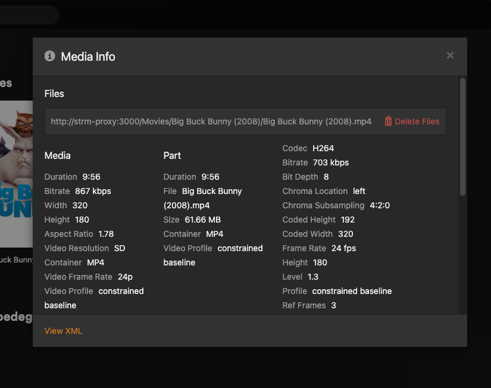

# plex-strm-assistant

[](LICENSE)
[](https://hub.docker.com/r/liveinaus/plex-strm-assistant)

Enables `.strm` file playback in Plex. Plex dropped native `.strm` support, so this tool bridges the gap with two components:



- **strm-proxy** — a lightweight HTTP server that reads a `.strm` file and returns a `302` redirect to the URL inside it.
- **SQLite triggers** — installed once into the Plex database. Whenever Plex scans a `.strm` file, the trigger rewrites the stored path to a proxy URL (`http://strm-proxy:3000/...`). Rescans are handled automatically — no re-patching needed.

---

## Prerequisites

- Docker
- A Plex Media Server (Dockerised or native) that has completed initial setup at least once

---

## `.strm` file format

Each `.strm` file contains a single HTTP/HTTPS URL:

```text
https://example.com/path/to/video.mp4
```

Organise them the same way you would real media files:

```text
strm/
  Movies/
    Big Buck Bunny (2008)/
      Big Buck Bunny (2008).strm
  TV Shows/
    Some Show/
      Season 01/
        Some Show - S01E01.strm
```

---

## Setup

Running Plex and the proxy in the same Docker Compose file is recommended. Both containers share a Docker network, so the proxy is reachable at `strm-proxy` without needing to expose an IP address.

### 1. Create a `docker-compose.yml`

```yaml
services:
  strm-proxy:
    image: liveinaus/plex-strm-assistant
    container_name: strm-proxy
    environment:
      - STRM_ROOT=/strm
      - PORT=3000
      - STRM_PROXY_HOST=strm-proxy
      - "DB_PATH=/plex-config/Library/Application Support/Plex Media Server/Plug-in Support/Databases/com.plexapp.plugins.library.db"
      - SKIP_SETUP=${SKIP_SETUP:-false}
      - CONTAINER_PREFIX=/media/strm
    volumes:
      - ./strm:/strm:ro
      - ./plex-config:/plex-config
    ports:
      - '3000:3000'
    restart: unless-stopped

  plex:
    image: lscr.io/linuxserver/plex:latest
    container_name: plex
    ports:
      - '32400:32400'
    environment:
      - PUID=1000
      - PGID=1000
      - TZ=Australia/Sydney
      - VERSION=docker
      - PLEX_CLAIM=${PLEX_CLAIM:-}
    volumes:
      - ./plex-config:/config
      - ./strm:/media/strm:ro
    restart: unless-stopped
```

Place your `.strm` files under `./strm/` and Plex config will be persisted under `./plex-config/`.

### 2. First run — let Plex initialise

Start Plex on its own so it can create its database:

```bash
docker compose up plex
```

Wait until Plex is accessible at `http://localhost:32400/web` and complete the initial setup. Then stop it:

```bash
docker compose stop plex
```

### 3. Install triggers

> **Important:** Plex must be stopped during trigger installation. Writing to the Plex database while Plex is running risks database corruption.

Start the proxy — it will install the SQLite triggers then start serving:

```bash
docker compose up strm-proxy
```

Wait for:

```text
strm-proxy | Setup complete. Plex rescans and new .strm files are now handled automatically.
strm-proxy | strm-proxy on :3000  root: /strm
```

### 4. Start everything

```bash
docker compose up -d
```

Add a library in Plex pointing at `/media/strm` and run a scan. Files will be playable immediately.

---

## Standalone usage (proxy only)

If Plex is already running outside of Docker Compose, you can run the proxy on its own. Set `STRM_PROXY_HOST` to a hostname or IP reachable by both the Plex server and your Plex clients.

```bash
docker run -d \
  --name strm-proxy \
  -p 3000:3000 \
  -v /path/to/your/strm:/strm:ro \
  -v /path/to/plex/config:/plex-config \
  -e STRM_PROXY_HOST=<hostname-or-ip> \
  liveinaus/plex-strm-assistant
```

---

## Multiple `.strm` directories

If your `.strm` files live in separate directories, mount each one as a subdirectory under `/strm`. The trigger matches everything under the prefix recursively so no code changes are needed.

```bash
docker run -d \
  --name strm-proxy \
  -p 3000:3000 \
  -v /path/to/movies-strm:/strm/Movies:ro \
  -v /path/to/tv-strm:/strm/TV:ro \
  -v /path/to/plex/config:/plex-config \
  -e STRM_PROXY_HOST=<hostname-or-ip> \
  liveinaus/plex-strm-assistant
```

Mount the same directories into Plex under `/media/strm/Movies` and `/media/strm/TV` respectively so the paths align.

---

## Environment variables

| Variable | Default | Description |
| --- | --- | --- |
| `PORT` | `3000` | Port the proxy listens on (also used to build stored proxy URLs) |
| `STRM_PROXY_HOST` | `strm-proxy` | Hostname used in proxy URLs stored in the Plex DB |
| `STRM_ROOT` | `/strm` | Mount point for `.strm` files inside the proxy container |
| `CONTAINER_PREFIX` | `/media/strm` | Path where `.strm` files are mounted inside the Plex container |
| `DB_PATH` | *(see Dockerfile)* | Full path to `com.plexapp.plugins.library.db` inside the proxy container |
| `SKIP_SETUP` | `false` | Set to `true` to skip trigger installation on container start (safe while Plex is running) |

---

## Restarting the proxy

The proxy can be restarted at any time without stopping Plex by setting `SKIP_SETUP=true`:

```bash
docker run ... -e SKIP_SETUP=true liveinaus/plex-strm-assistant
```

---

## Database recovery

If Plex reports *"database disk image is malformed"*:

```bash
# Stop Plex first
DB="/path/to/plex/config/Library/Application Support/Plex Media Server/Plug-in Support/Databases/com.plexapp.plugins.library.db"
sqlite3 "$DB" ".recover" | sqlite3 "${DB}.fresh"
mv "$DB" "${DB}.dead" && mv "${DB}.fresh" "$DB"
rm -f "${DB}-wal" "${DB}-shm"
# Start Plex again
```

---

## Roadmap

- [x] HTTP proxy that resolves `.strm` files to stream URLs via `302` redirect
- [x] SQLite triggers to survive Plex rescans automatically
- [x] Inject H.264/AAC codec metadata to force direct play (no transcoding)
- [x] Docker container — installs triggers on start, then runs proxy
- [x] Multi-platform image (amd64, arm64)
- [x] Safe first-run handling — waits for Plex DB, `SKIP_SETUP` flag for restarts
- [ ] Disable unnecessary Plex processing on `.strm` items (analysis, thumbnail generation, etc.)
- [ ] Follow 302 redirects from the source URL before returning to Plex — enables compatibility with services that require a redirect step (e.g. 115 Drive)

---

## Contributing

Contributions are welcome! Whether it's a bug fix, a new feature, or an idea from the roadmap — feel free to open an issue or submit a pull request.

If you'd like to get more involved and collaborate on the project long-term, reach out via GitHub. All skill levels are welcome.

[github.com/liveinaus/plex-strm-assistant](https://github.com/liveinaus/plex-strm-assistant)

---

## Support

If this project saves you some time, a GitHub star would be appreciated!
[github.com/liveinaus/plex-strm-assistant](https://github.com/liveinaus/plex-strm-assistant)

---

## Disclaimer

This project is an independent, community-built tool and is not affiliated with, endorsed by, or supported by Plex Inc. in any way.

Using this tool involves writing directly to the Plex SQLite database and modifying internal data structures. This may conflict with Plex's Terms of Service or void any support entitlements. Use it at your own risk.

The author accepts no responsibility for data loss, database corruption, account suspension, or any other consequence arising from the use of this software.

---

## Licence

MIT — free to use and modify. You must retain the copyright notice and a link back to this repository in any copies or derivatives. See [LICENSE](LICENSE) for the full text.
