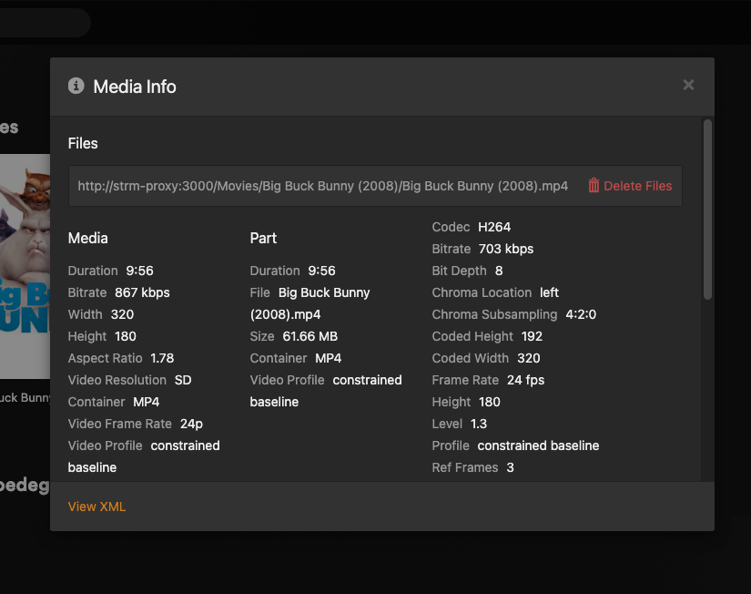

# plex-strm-assistant

[](LICENSE)
[](https://hub.docker.com/r/liveinaus/plex-strm-assistant)

Enables `.strm` file playback in Plex. Plex dropped native `.strm` support, so this tool bridges the gap with two components:



- **strm-proxy**: a lightweight HTTP server that reads a `.strm` file and returns a `302` redirect to the URL inside it.
- **SQLite triggers**: installed once into the Plex database. Whenever Plex scans a `.strm` file, the trigger rewrites the stored path to a proxy URL (`http://strm-proxy:3000/...`). Rescans are handled automatically, so no re-patching is needed.

Optionally, the [direct streaming gateway](#direct-streaming-gateway-source---client-bypassing-plex) lets clients stream straight from the source (e.g. 115 Drive) without the video passing through the Plex server.

---

## Quick start (Docker Compose)

This is the recommended setup. Plex and the proxy run in the same Compose file and share a Docker network, so the proxy is reachable at `strm-proxy` without exposing an IP address.

**Prerequisites:** Docker with the Compose plugin.

### 1. Create the project folder

```bash
mkdir plex-strm && cd plex-strm
mkdir strm plex-config
```

- `strm/` holds your `.strm` files (see [.strm file format](#strm-file-format) below)
- `plex-config/` persists the Plex configuration and database

### 2. Create `docker-compose.yml`

All proxy settings have sensible defaults built into the image, so no environment configuration is needed for this layout:

```yaml
services:
  strm-proxy:
    image: liveinaus/plex-strm-assistant
    container_name: strm-proxy
    environment:
      - SKIP_SETUP=${SKIP_SETUP:-false}
    volumes:
      - ./strm:/strm:ro
      - ./plex-config:/plex-config
    ports:
      - '3000:3000'
    restart: unless-stopped

  plex:
    image: lscr.io/linuxserver/plex:latest
    container_name: plex
    ports:
      - '32400:32400'
    environment:
      - PUID=1000
      - PGID=1000
      - TZ=Australia/Sydney
      - VERSION=docker
      - PLEX_CLAIM=${PLEX_CLAIM:-}
    volumes:
      - ./plex-config:/config
      - ./strm:/media/strm:ro
    restart: unless-stopped
```

> **Tip:** to link Plex to your account, get a claim token from [plex.tv/claim](https://www.plex.tv/claim/) (valid for 4 minutes) and start with `PLEX_CLAIM=claim-xxxx docker compose up plex`.

### 3. Start Plex alone and let it initialise

Plex needs to create its database before the triggers can be installed:

```bash
docker compose up -d plex
```

Open `http://localhost:32400/web` and complete the initial setup wizard. Then stop Plex:

```bash
docker compose stop plex
```

> **Important:** Plex must be stopped for the next step. Writing to the Plex database while Plex is running risks database corruption.

### 4. Start the proxy to install the triggers

```bash
docker compose up strm-proxy
```

Wait for this output, which confirms the triggers are installed:

```text
strm-proxy | Setup complete. Plex rescans and new .strm files are now handled automatically.
strm-proxy | strm-proxy on :3000  root: /strm
```

Press `Ctrl+C` to stop it.

### 5. Start everything

```bash
docker compose up -d
```

In Plex, add a library pointing at `/media/strm` and run a scan. Files will be playable immediately.

---

## .strm file format

Each `.strm` file contains a single HTTP/HTTPS URL:

```text
https://example.com/path/to/video.mp4
```

Organise them under `strm/` the same way you would real media files:

```text
strm/
  Movies/
    Big Buck Bunny (2008)/
      Big Buck Bunny (2008).strm
  TV Shows/
    Some Show/
      Season 01/
        Some Show - S01E01.strm
```

New `.strm` files are picked up automatically on the next Plex scan. No proxy restart is required.

---

## Restarting the proxy

The triggers only need to be installed once. To restart the proxy at any time without stopping Plex, set `SKIP_SETUP=true` so trigger installation is skipped:

```bash
SKIP_SETUP=true docker compose up -d strm-proxy
```

---

## Configuration

All variables are optional. The defaults match the Quick start layout, so you only need these if your mount paths or hostnames differ.

| Variable                 | Default                                                                                                               | Description                                                                                                                                                                       |
| ------------------------ | --------------------------------------------------------------------------------------------------------------------- | --------------------------------------------------------------------------------------------------------------------------------------------------------------------------------- |
| `PORT`                   | `3000`                                                                                                                | Port the proxy listens on (also used to build stored proxy URLs)                                                                                                                  |
| `STRM_PROXY_HOST`        | `strm-proxy`                                                                                                          | Hostname used in proxy URLs stored in the Plex DB                                                                                                                                 |
| `STRM_ROOT`              | `/strm`                                                                                                               | Mount point for `.strm` files inside the proxy container                                                                                                                          |
| `CONTAINER_PREFIX`       | `/media/strm`                                                                                                         | Path where `.strm` files are mounted inside the Plex container                                                                                                                    |
| `DB_PATH`                | `/plex-config/Library/Application Support/Plex Media Server/Plug-in Support/Databases/com.plexapp.plugins.library.db` | Full path to the Plex database inside the proxy container                                                                                                                         |
| `SKIP_SETUP`             | `false`                                                                                                               | Set to `true` to skip trigger installation (safe while Plex is running)                                                                                                           |
| `FOLLOW_REDIRECTS`       | `false`                                                                                                               | Set to `true` to resolve the source URL's redirect chain server-side and return the final URL to Plex. Needed for services where the `.strm` URL is a redirector (e.g. 115 Drive) |
| `GATEWAY_ENABLED`        | `false`                                                                                                               | Set to `true` to start the direct streaming gateway alongside the proxy                                                                                                           |
| `GATEWAY_MODE`           | `direct-play`                                                                                                         | `direct-play`: client fetches the source (302). `direct-stream`: gateway relays the source bytes for in-cluster/private sources (see [gateway](#direct-streaming-gateway-source---client-bypassing-plex)) |
| `GATEWAY_PORT`           | `32500`                                                                                                               | Port the gateway listens on                                                                                                                                                       |
| `PLEX_UPSTREAM`          | `http://plex:32400`                                                                                                   | Plex Media Server address the gateway forwards to                                                                                                                                 |
| `GATEWAY_VALIDATE_TOKEN` | `true`                                                                                                                | Validate the `X-Plex-Token` against Plex before redirecting media part requests. Set to `false` only on LAN-only setups                                                           |
| `ANALYZE_ON_PLAY`        | `false`                                                                                                               | Set to `true` to have the gateway ask Plex to analyse a `.strm` item the first time it's played, if Plex hasn't yet (see [Real Media Info](#real-media-info))                     |

---

## Real Media Info

A `.strm` has no local file, so until Plex analyses one it shows the placeholder H.264/AAC that
the setup triggers seed to force direct play. Plex can analyse `.strm` items like any other file,
but on its own it leaves many of them unanalysed, even after they've been played.

That placeholder is not only cosmetic. An official Plex client asks the server how to play an item
before it starts, and for an unanalysed `.strm` the answer is _"App cannot direct play this item.
Container is unavailable for analysis"_, then _"Neither direct play nor conversion is available"_:
the play errors, and retrying keeps failing until the item has been analysed. Third-party clients
and Plex Web are not affected -- they fetch the media part, which the gateway answers itself.

Set `ANALYZE_ON_PLAY=true` and the gateway asks Plex to analyse such an item the first time it sees
it played, in either gateway mode -- whether the client asks Plex how to play it first, or goes
straight for the media part as some clients do. It takes Plex a few seconds to a minute, after
which official clients can play the item and Plex has the real container, codecs, bitrate and every
audio and subtitle track. The request uses the server's own token from `Preferences.xml`, so
it works whichever user is playing; like the TLS cert, the file is found relative to `DB_PATH`.
Codecs are then reported truthfully, so a client may choose to transcode.

---

## Alternative setups

### Standalone (Plex runs elsewhere)

If Plex is already running outside of Docker Compose, run the proxy on its own. Set `STRM_PROXY_HOST` to a hostname or IP reachable by both the Plex server and your Plex clients. The first-run order still applies: stop Plex before the first start of the proxy so the triggers can be installed safely.

```bash
docker run -d \
  --name strm-proxy \
  -p 3000:3000 \
  -v /path/to/your/strm:/strm:ro \
  -v /path/to/plex/config:/plex-config \
  -e STRM_PROXY_HOST=<hostname-or-ip> \
  liveinaus/plex-strm-assistant
```

### Multiple `.strm` directories

If your `.strm` files live in separate directories, mount each one as a subdirectory under `/strm`. The trigger matches everything under the prefix recursively, so no code changes are needed.

```bash
docker run -d \
  --name strm-proxy \
  -p 3000:3000 \
  -v /path/to/movies-strm:/strm/Movies:ro \
  -v /path/to/tv-strm:/strm/TV:ro \
  -v /path/to/plex/config:/plex-config \
  -e STRM_PROXY_HOST=<hostname-or-ip> \
  liveinaus/plex-strm-assistant
```

Mount the same directories into Plex under `/media/strm/Movies` and `/media/strm/TV` respectively so the paths align.

### Redirect-based services (e.g. 115 Drive)

Some services store a redirector URL in the `.strm` file rather than a direct media URL, and require an extra redirect step before the real stream URL is issued. Enable server-side redirect resolution on the proxy:

```yaml
strm-proxy:
  environment:
    - FOLLOW_REDIRECTS=true
```

On each play request the proxy follows the redirect chain (forwarding the caller's User-Agent, which services like 115 bind the stream URL to) and returns the final URL to Plex. Streaming still flows through the Plex server as normal. To stream directly from the source to your clients instead, see the [direct streaming gateway](#direct-streaming-gateway-source---client-bypassing-plex).

> **Note for 115 Drive:** Plex's media analysis makes many requests per file during a library scan, which can trip 115's rate limits. Keep libraries small until scan-time processing can be disabled (see Roadmap).

---

## Direct streaming gateway (source -> client, bypassing Plex)

By default, Plex fetches the stream itself and relays it to your clients:

```text
Default:        source (e.g. 115 CDN) -> Plex server -> client
Gateway mode:   source (e.g. 115 CDN) ---------------> client
```

The gateway is a reverse proxy that sits in front of Plex: clients connect to it instead of the Plex port. All requests (browsing, metadata, transcoding, websockets) pass through to Plex untouched. Only two request types for `.strm` items are intercepted, and how they're handled depends on `GATEWAY_MODE`:

**`direct-play` (default)** — removes the Plex server from the media path (similar to what [MediaWarp](https://github.com/AkimioJR/MediaWarp) does for Emby/Jellyfin). Use when the source is reachable by your clients (e.g. a public CDN).

- **Media part requests**: the gateway resolves the final source URL and answers with a `302` the client follows, so video flows straight from the source.
- **Transcode decision requests**: rewritten to force Direct Play (quality caps stripped, burned-in subtitles switched to separate delivery), coercing clients that would otherwise transcode into direct playing.

**`direct-stream`** — the gateway **relays the source bytes itself** (Range-aware), so an off-network client never has to reach the source. Use when the source is only reachable in-cluster / on a private network (e.g. `http://…svc.cluster.local`, or the in-pod proxy).

- **Media part requests**: the gateway streams the source through itself instead of 302-ing.
- **Transcode decision requests**: rewritten to Direct Stream (`directPlay=0`, `directStream=1`) so Plex also relays via its own transcode session where clients use that path.

In both modes, Plex Web is exempt (browsers block cross-origin media fetches via CORS and already fall back to Direct Stream through Plex), and non-`.strm` items pass straight through. The gateway reads the Plex database read-only, so it is safe while Plex runs and needs no extra setup step.

> **Which mode?** If your `.strm` URLs point at something your phone/TV can reach directly → `direct-play`. If they point at an in-cluster/private source only the server can reach (the classic "works on web, fails in the app with connection refused" case) → `direct-stream`. Clients must be pointed at the gateway either way, or nothing is intercepted.

### 1. Enable the gateway

Complete the [Quick start](#quick-start-docker-compose) first, then update the `strm-proxy` service in your `docker-compose.yml`:

```yaml
services:
  strm-proxy:
    image: liveinaus/plex-strm-assistant
    container_name: strm-proxy
    environment:
      - SKIP_SETUP=${SKIP_SETUP:-false}
      - GATEWAY_ENABLED=true
      # direct-play (default) or direct-stream (relay in-cluster/private sources)
      - GATEWAY_MODE=direct-play
      # Resolve redirector URLs (e.g. 115) per play request, bound to the client
      - FOLLOW_REDIRECTS=true
    volumes:
      - ./strm:/strm:ro
      - ./plex-config:/plex-config
    ports:
      - '3000:3000'
      - '32500:32500' # gateway: clients connect here instead of :32400
    restart: unless-stopped
```

### 2. Restart the proxy

Plex can keep running; the triggers are already installed:

```bash
SKIP_SETUP=true docker compose up -d strm-proxy
```

The logs should show both services:

```text
strm-proxy | strm-proxy on :3000  root: /strm
strm-proxy | strm-gateway on :32500  ->  http://plex:32400/  (following upstream redirects)
```

### 3. Point your clients at the gateway

Clients must reach Plex through port `32500` instead of `32400`:

- **Plex Web:** browse to `http://<your-host>:32500/web`
- **Plex apps (recommended):** in Plex, open **Settings > Network > Custom server access URLs** and add `http://<your-host>:32500`. Apps that discover the server through your Plex account will then connect via the gateway automatically.

Use a hostname or IP that your clients can reach on your network, not `localhost`.

### Secure connections (`app.plex.tv`)

`app.plex.tv` is served over HTTPS and refuses an insecure server connection, so a plain-HTTP gateway triggers _"unable to connect securely."_ Set `GATEWAY_TLS=true` and the gateway serves the client side with Plex's own `plex.direct` certificate — read from the shared Plex config volume — so `app.plex.tv` validates it exactly as it would the real server. The cert is reloaded automatically when Plex renews it.

`GATEWAY_TLS`:

- `false` (default) — plain HTTP.
- `true` — HTTPS with Plex's `plex.direct` cert. **The gateway exits on startup if the cert can't be loaded** (bad config mount, or Plex hasn't generated its cert yet).

For HTTPS, route the address Plex advertises for secure connections — its `plex.direct` host on port `32400` — to the gateway (external `:32400` → gateway). The Plex config volume must be mounted into the proxy container (it already is, for DB access); the cert is found relative to `DB_PATH`.

### 4. Verify it works

Play a `.strm` item and watch the gateway logs:

```bash
docker logs -f strm-proxy
```

A direct-play start looks like this, with the final source URL on the right:

```text
strm-proxy | MDE  forcing direct play  /video/:/transcode/universal/decision?...directPlay=1...
strm-proxy | 302  part 1234  ->  https://cdnfhnfile.115cdn.net/...
```

If you do not see a `302 part` line while the video plays, the client connected to Plex directly (check step 3) or Plex is transcoding instead of direct playing (check the playback quality settings on the client; the session dashboard in Plex shows Direct Play vs Transcode).

### Limitations

- Only direct play bypasses Plex. Transcoded playback still flows through the Plex server, since Plex must read the stream to transcode it.
- Forced direct play means the client receives the original file as-is. A client that genuinely cannot decode it (codec, HDR, container) will fail to play or fall back to transcoding on its own.
- The client fetches the media itself, so it needs internet access to the source/CDN.
- Media part redirects require a valid `X-Plex-Token`, checked against your Plex server (cached for 5 minutes). Requests without one fall through to Plex, which rejects them as normal. Set `GATEWAY_VALIDATE_TOKEN=false` to skip the check on LAN-only setups.
- The resolved source URL in the `302` is handed to the client unauthenticated (the CDN URL itself is the credential), so treat gateway logs as sensitive.

---

## Troubleshooting

### Proxy logs "Waiting for Plex DB"

The proxy could not find the Plex database at `DB_PATH`. Make sure Plex has been started at least once (step 3 of the Quick start) and that the Plex config directory is mounted at `/plex-config` in the proxy container.

### Embedded subtitles or extra audio tracks are missing

Plex is not given real stream data for a remote URL, so the triggers seed a placeholder H.264/AAC pair to keep direct play working. That placeholder describes one video and one stereo audio track only, so embedded subtitle and secondary audio tracks do not appear on their own. Real probing of the source is on the roadmap.

Sidecar subtitles do work in the meantime: put a `.srt` next to the `.strm` with a matching base name (`Movie (2008).strm` and `Movie (2008).en.srt`) and rescan the library. The triggers leave any stream Plex discovers in place, including on later rescans.

### "Database disk image is malformed"

If Plex reports this, recover the database:

```bash
# Stop Plex first
DB="/path/to/plex/config/Library/Application Support/Plex Media Server/Plug-in Support/Databases/com.plexapp.plugins.library.db"
sqlite3 "$DB" ".recover" | sqlite3 "${DB}.fresh"
mv "$DB" "${DB}.dead" && mv "${DB}.fresh" "$DB"
rm -f "${DB}-wal" "${DB}-shm"
# Start Plex again
```

---

## Roadmap

- [x] HTTP proxy that resolves `.strm` files to stream URLs via `302` redirect
- [x] SQLite triggers to survive Plex rescans automatically
- [x] Inject H.264/AAC codec metadata to force direct play (no transcoding)
- [x] Real audio and subtitle track metadata in Plex: the gateway has Plex analyse a `.strm` item on first play (`ANALYZE_ON_PLAY=true`, see [Real Media Info](#real-media-info))
- [x] Docker container that installs triggers on start, then runs the proxy
- [x] Multi-platform image (amd64, arm64)
- [x] Safe first-run handling: waits for the Plex DB, `SKIP_SETUP` flag for restarts
- [ ] Disable unnecessary Plex processing on `.strm` items (analysis, thumbnail generation, etc.)
- [x] Follow 302 redirects from the source URL before returning to Plex (`FOLLOW_REDIRECTS=true`), enabling compatibility with services that require a redirect step (e.g. 115 Drive)
- [x] Direct streaming gateway (`GATEWAY_ENABLED=true`): direct-play traffic goes straight from the source to the client, bypassing the Plex server (MediaWarp-style)
- [x] Gateway `direct-stream` mode (`GATEWAY_MODE=direct-stream`): relay the source bytes through the gateway for sources only reachable in-cluster / on a private network

---

## Running from source

The Docker image ships Node 26, and the published CLI targets **Node 24 or newer** (`engines` in `package.json`). `node:sqlite` no longer needs the `--experimental-sqlite` flag (since Node 22.13 and 23.4), so the npm scripts run it directly. On runtimes older than that, `npm start` / `npm run dev` fail; upgrade Node rather than re-adding the flag.

---

## Contributing

Contributions are welcome! Whether it's a bug fix, a new feature, or an idea from the roadmap, feel free to open an issue or submit a pull request.

If you'd like to get more involved and collaborate on the project long-term, reach out via GitHub. All skill levels are welcome.

[github.com/liveinaus/plex-strm-assistant](https://github.com/liveinaus/plex-strm-assistant)

---

## Support

If this project saves you some time, a GitHub star would be appreciated!
[github.com/liveinaus/plex-strm-assistant](https://github.com/liveinaus/plex-strm-assistant)

---

## Disclaimer

This project is an independent, community-built tool and is not affiliated with, endorsed by, or supported by Plex Inc. in any way.

Using this tool involves writing directly to the Plex SQLite database and modifying internal data structures. This may conflict with Plex's Terms of Service or void any support entitlements. Use it at your own risk.

The author accepts no responsibility for data loss, database corruption, account suspension, or any other consequence arising from the use of this software.

---

## Licence

MIT: free to use and modify. You must retain the copyright notice and a link back to this repository in any copies or derivatives. See [LICENSE](LICENSE) for the full text.
